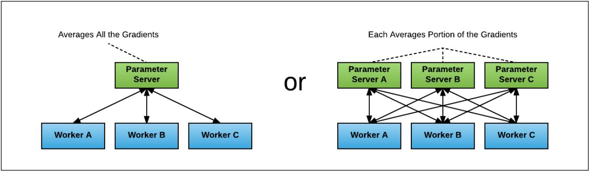
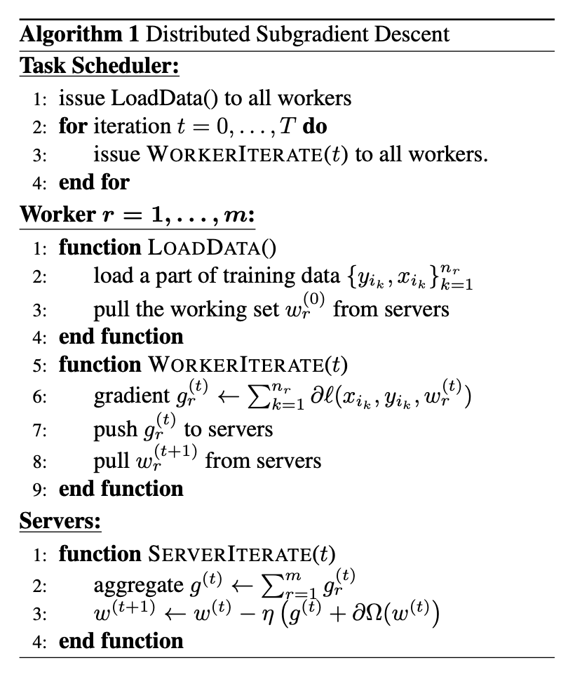

An implementation of [parameter server](https://www.usenix.org/system/files/conference/osdi14/osdi14-paper-li_mu.pdf) (PS) framework based on Remote Procedure Call (RPC) in [PyTorch](https://pytorch.org/).
## PS-based Architecture
<div align=center></div>
The figure below shows the PS-based architecture. The architecture consists of two logical entities: one (or multiple) PS(s) and multiple workers. The whole dataset is partitioned among workers and the PS maintains model parameters. During training, each worker pulls model parameters from the PS, computes gradients on a mini-batch from its data partition, and pushes the gradients to the PS. The PS updates model parameters with gradients from the workers according to a synchronization strategy and sends the updated parameters back to the workers. The pseudocode of this architecture is shown as follows.
<div align=center></div>

## Implementation
This code is based on [torch.distributed.rpc](https://pytorch.org/docs/1.9.0/rpc.html). It includes one PS and 4 workers.
## Environments
The code is developed under the following configurations.  
Server: a g3.16xlarge instance with 4 NVIDIA Tesla M60 GPUs on AWS EC2  
System: Ubuntu 18.04  
Software: python==3.6.9, torch==1.9.0, torchvision==0.10.0  
## Quick Start
#### 1. Download the code
```bash
git clone https://github.com/xbfu/PyTorch-ParameterServer.git
```
#### 2. Install requirements
```bash
pip3 install -r requirements.txt
```
#### 3. Prepare datasets
```bash
cd PyTorch-ParameterServer/data
wget https://s3.amazonaws.com/fast-ai-imageclas/imagenette2.tgz
tar -zxf imagenette2.tgz
```
#### 4. Train
